# Agent 模块函数依赖分析

## 函数依赖关系图

以下 Mermaid 图展示了 `linhai/agent/main.py` 中主要函数之间的调用关系和数据流：

```mermaid
graph TD
    create_agent --> _create_llm_instances
    create_agent --> _create_agent_context
    create_agent --> _create_tool_manager
    create_agent --> _create_init_messages

    Agent_run[Agent.run] --> Agent_state_waiting_user[Agent.state_waiting_user]
    Agent_run --> Agent_state_working[Agent.state_working]

    Agent_state_waiting_user --> Agent_generate_response[Agent.generate_response]
    Agent_state_waiting_user --> Agent_handle_user_message[Agent.handle_user_message]

    Agent_state_working --> Agent_generate_response
    Agent_state_working --> Agent_handle_user_message

    Agent_generate_response --> Agent__select_model[Agent._select_model]
    Agent_generate_response --> Agent_call_tool[Agent.call_tool]
    Agent_generate_response --> Agent_save_conversation_history[Agent.save_conversation_history]
    Agent_generate_response --> Agent_interrupt[Agent.interrupt]

    Agent_call_tool --> switch_llm
    Agent_call_tool --> current_llm
    Agent_call_tool --> get_token_usage
    Agent_call_tool --> thanox_history
    Agent_call_tool --> erase_message_by_id_tool
    Agent_call_tool --> compress_history_range_tool

    get_token_usage --> Agent_get_threshold_info[Agent.get_threshold_info]
    erase_message_by_id_tool --> Agent_erase_message_by_id_class[Agent.erase_message_by_id]
    compress_history_range_tool --> compress_history_range

    Agent_handle_user_message --> parse_user_input
    Agent_call_tool --> ToolManager_process_tool_call[ToolManager.process_tool_call]
    Agent_generate_response --> model_answer_stream[model.answer_stream]

    switch_llm -.-> Agent_context[Agent.context]
    current_llm -.-> Agent_context
    thanox_history -.-> Agent_messages[Agent.messages]
    Agent_handle_user_message -.-> Agent_messages
    Agent_get_threshold_info -.-> Agent_context
    Agent_erase_message_by_id_class -.-> Agent_large_messages[Agent.large_messages]
    Agent_save_conversation_history -.-> Agent_messages

    Agent_call_tool --> Lifecycle_before_tool_call[Lifecycle.trigger_before_tool_call]
    Agent_call_tool --> Lifecycle_after_tool_call[Lifecycle.trigger_after_tool_call]
    Agent_generate_response --> Lifecycle_before_message_generation[Lifecycle.trigger_before_message_generation]
    Agent_generate_response --> Lifecycle_during_message_generation[Lifecycle.trigger_during_message_generation]
    Agent_generate_response --> Lifecycle_after_message_generation[Lifecycle.trigger_after_message_generation]

    classDef factory fill:#e1f5fe
    classDef agentMethod fill:#f3e5f5
    classDef toolFunction fill:#e8f5e8
    classDef external fill:#fff3e0

    class create_agent,_create_llm_instances,_create_agent_context,_create_tool_manager,_create_init_messages factory
    class Agent_run,Agent_state_waiting_user,Agent_state_working,Agent_generate_response,Agent__select_model,Agent_call_tool,Agent_save_conversation_history,Agent_interrupt,Agent_handle_user_message,Agent_get_threshold_info,Agent_erase_message_by_id_class agentMethod
    class switch_llm,current_llm,get_token_usage,thanox_history,erase_message_by_id_tool,compress_history_range_tool toolFunction
    class parse_user_input,ToolManager_process_tool_call,model_answer_stream,Lifecycle_before_tool_call,Lifecycle_after_tool_call,Lifecycle_before_message_generation,Lifecycle_during_message_generation,Lifecycle_after_message_generation,compress_history_range external
```



## 依赖关系说明

### 核心调用链
1. **Agent 启动流程**: `create_agent` → 各种工厂函数 → `Agent.run` → 状态处理
2. **状态机流转**: `Agent.run` 根据状态调用 `state_waiting_user` 或 `state_working`
3. **响应生成**: 状态方法调用 `generate_response`，后者协调模型选择、工具调用和历史保存
4. **工具调用**: `call_tool` 作为枢纽，分发到具体的工具函数

### 数据依赖
- **上下文依赖**: 多个工具函数依赖 `Agent.context` 获取配置信息
- **消息管理**: 用户消息处理和历史保存依赖 `Agent.messages` 队列
- **大消息管理**: 擦除操作依赖 `Agent.large_messages` 映射

### 外部依赖
- **输入解析**: `parse_user_input` 用于处理用户命令
- **工具管理**: `ToolManager.process_tool_call` 执行实际工具调用
- **模型交互**: `model.answer_stream` 处理 LLM 流式响应
- **生命周期**: 各种生命周期回调

### 模块耦合度分析

**高耦合模块：**
- `Agent.generate_response`：与模型调用、工具调用、生命周期管理、消息处理等多个模块耦合
- `Agent.call_tool`：与工具管理器、生命周期回调、消息队列紧密耦合

**中等耦合模块：**
- 工厂函数：相互之间有一定依赖，但职责相对清晰
- 状态处理方法：主要依赖 `generate_response` 和消息处理

**低耦合模块：**
- 工具函数：相对独立，主要通过装饰器注册
- 辅助函数：如 `_select_model`、`get_threshold_info` 等

## 重构建议

基于依赖关系分析，建议按以下方式重构：

### 1. 提取状态管理器 (StateManager)
```python
class StateManager:
    async def handle_waiting_user(self)
    async def handle_working(self)
    async def transition_state(self, new_state)
```

### 2. 提取工具处理器 (ToolHandler)
```python
class ToolHandler:
    async def call_tool(self, tool_call)
    def register_toolset(self, toolset)
    def handle_tool_confirmation(self, tool_call)
```

### 3. 提取消息处理器 (MessageProcessor)
```python
class MessageProcessor:
    def handle_user_message(self, msg)
    def add_message(self, msg)
    def get_messages(self)
    def compress_history_if_needed(self)
```

### 4. 提取生命周期管理器 (LifecycleManager)
```python
class LifecycleManager:
    async def trigger_before_tool_call(self, tool_call)
    async def trigger_after_tool_call(self, tool_call, result, success)
    # ... 其他生命周期方法
```

### 5. 重构后的 Agent 类
```python
class Agent:
    def __init__(self, context, group_chat, init_messages):
        self.state_manager = StateManager(self)
        self.tool_handler = ToolHandler(self)
        self.message_processor = MessageProcessor(self)
        self.lifecycle_manager = LifecycleManager(self)
        # ... 其他初始化
```

这样重构后，每个模块职责单一，耦合度降低，便于测试和维护喵~。