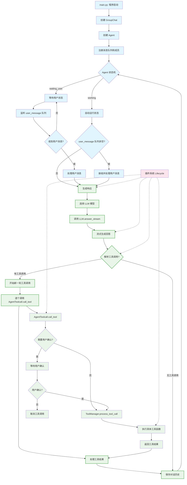

# LinHai Agent 运行时交互流程图

## 关键类交互说明

### 核心 Agent 类
- **Agent**: 主控制器，管理状态机和整体流程
- **GroupChat**: 消息总线，负责类间通信和解耦
- **AgentMessage**: 消息处理器，管理消息队列和历史
- **AgentToolcall**: 工具调用处理器

### LLM 相关
- **LanguageModel**: LLM 接口协议
- **OpenAi**: OpenAI API 实现
- **Answer**: 流式回答接口

### 工具系统
- **ToolManager**: 工具管理器
- **ToolSet**: 工具集合
- **MCPConnector**: MCP 服务器连接器

### 插件系统
- **Lifecycle**: 生命周期管理器，统一管理各种检查插件

## 主要交互流程

1. **启动流程**: main.py → GroupChat → Agent → 注册队列和成员
2. **状态循环**: Agent 在 waiting_user 和 working 状态间切换
3. **消息处理**: 接收用户消息 → 处理 → 生成响应
4. **generate_response 函数**: 负责LLM响应生成、工具调用触发和结果处理（绿色边框标记）
5. **工具调用**: AgentToolcall.call_tool 处理具体工具执行逻辑
6. **插件拦截**: 插件系统在关键节点进行各种检查和拦截

## 元素颜色说明

- **绿色边框**: `generate_response` 函数内的核心步骤
- **蓝色**: Agent 核心类和状态机相关
- **紫色**: 工具调用相关类
- **粉色**: 插件系统
- **橙色**: LLM 相关类

这个流程图展示了 LinHai Agent 运行时各个核心类之间的交互关系，忽略 utility 类，重点关注主要的控制流和数据流喵~